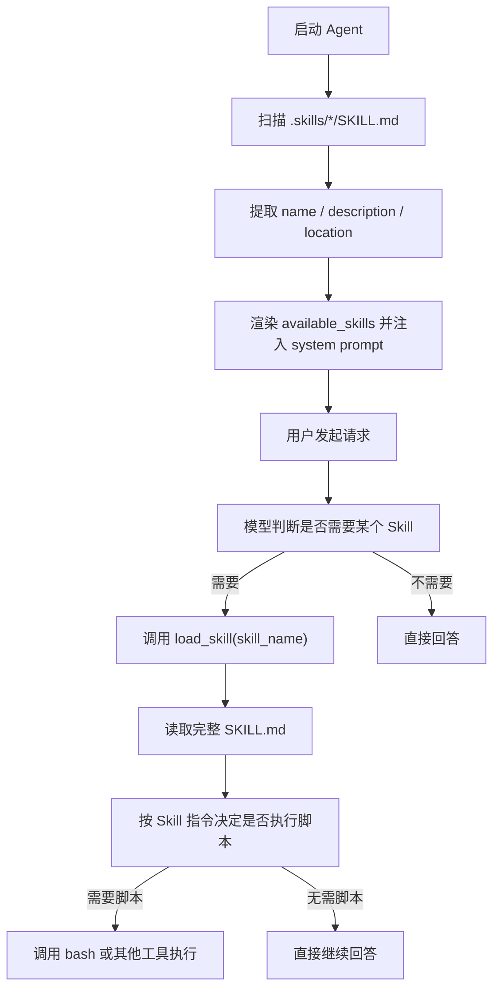

# Skills Agent Demo

一个最小可运行的 Demo，用来演示 Agent 如何：

1. 自动发现本地 Skills
2. 将 Skill 元信息注入 system prompt
3. 在真正需要时，再通过工具按需加载某个 `SKILL.md`

这个项目的重点不是做一个完整的通用 Agent，而是把 “Skill discovery + lazy loading” 这条链路拆得足够小、足够清楚，方便研究和二次改造。

如果你在关注 Codex、Claude Code、Cursor 这类“用本地技能文件增强 Agent”的设计，这个仓库可以作为一个很轻量的参考实现。

## 它解决的问题

这个 Demo 主要回答一个问题：

> Agent 怎么先知道“有哪些技能可用”，再决定要不要加载其中一个？

这里采用的是一个轻量的三段式策略：

1. 启动时只扫描 `.skills/*/SKILL.md`
2. 只提取每个 Skill 的轻量元信息：`name`、`description`、`location`
3. 把技能列表拼进 system prompt
4. 模型根据用户请求判断是否需要某个 Skill
5. 如果需要，再调用 `load_skill(skill_name)` 读取完整技能内容
6. 当 Skill 附带脚本或可执行资源时，再通过工具执行对应动作

这样做的好处是：

- 初始上下文更小
- 技能发现、技能加载、动作执行三层职责分离
- 更接近真实 Agent 的工作方式

## 项目结构

```text
skills_agent/
├── main.py
├── agent.py
├── skill_manager.py
├── prompt_manager.py
├── tools.py
├── requirements.txt
├── prompts/
│   ├── system_prompt.md
│   └── skills_template.md
├── .skills/
│   ├── codebase_navigator/
│   │   └── SKILL.md
│   └── time_and_env/
│       ├── SKILL.md
│       └── scripts/
│           └── time_and_env.sh
└── utils/
    ├── debug_commands.py
    ├── langgraph_stream_printer.py
    ├── model_call_tracer.py
    └── stream_printer.py
```

各文件职责大致如下：

- `agent.py`：构建 LLM、注册工具、启动交互式对话
- `skill_manager.py`：扫描 `.skills/`、解析 front matter、按需加载技能
- `prompt_manager.py`：拼接基础 prompt 和动态技能列表
- `tools.py`：暴露给 Agent 的工具，例如 `bash`、`load_skill`
- `prompts/system_prompt.md`：基础系统提示词
- `prompts/skills_template.md`：技能列表模板

## 核心机制

### Level 1. 元数据注入

`skill_manager.py` 默认会扫描仓库中的 `.skills/` 目录：

```text
.skills/
└── <skill_name>/
    └── SKILL.md
```

每个 Skill 可以通过 front matter 提供元信息，例如：

```md
---
name: codebase-navigator
description: 代码库导航与定位：当用户问“某段代码在哪/怎么运行/配置在哪/报错怎么查”时，用 bash 快速搜索、打开文件并给出可执行的下一步。
---
```

启动时只会提取这些轻量信息，而不会把整个 `SKILL.md` 全部塞进上下文。

### Level 2. 指令加载

`prompt_manager.py` 会拼接两部分内容：

- `prompts/system_prompt.md`
- `prompts/skills_template.md` 渲染后的技能列表

最终模型能先看到类似这样的结构：

```xml
<available_skills>
  <skill>
    <name>codebase-navigator</name>
    <description>代码库导航与定位...</description>
    <location>/abs/path/to/.skills/codebase_navigator/SKILL.md</location>
  </skill>
</available_skills>
```

这样模型先知道“有什么技能”，再决定是否需要调用加载工具。

当模型判断某个 Skill 适用时，`tools.py` 暴露的这个工具会被调用：

```python
load_skill(skill_name: str) -> str
```

它会读取完整的 `SKILL.md`，并返回类似下面的内容：

```xml
<skill-loaded name="codebase-navigator">
  ...
</skill-loaded>
```

这一步相当于把某个 Skill 的详细指令延迟注入到上下文中。

### Level 3. 脚本执行

如果某个 Skill 不只是文字说明，还附带了脚本或其他可执行资源，那么模型在读取 `SKILL.md` 后，可以继续通过工具执行这些动作。

当前仓库里的 `time_and_env` 就是一个轻量示例：

- 先发现 `time-and-env` 这个 Skill
- 再加载 `.skills/time_and_env/SKILL.md`
- 然后通过 `bash` 工具执行 `.skills/time_and_env/scripts/time_and_env.sh`

这说明仓库已经具备三段式链路的最小实现：

- Level 1：元数据注入
- Level 2：指令加载
- Level 3：脚本执行

不过这里的第三段仍然是轻量版，主要用于展示机制，还不是一个独立、完备的 Skill Runtime。

## 快速开始

### 1. 安装依赖

仓库已经包含一个最小 `requirements.txt`：

```bash
pip install -r requirements.txt
```

当前依赖包括：

- `langchain`
- `langchain-anthropic`
- `jinja2`
- `python-dotenv`
- `rich`

### 2. 配置环境变量

项目会从仓库根目录读取 `.env`。当前代码里用到的主要变量有：

```bash
MODEL_API_KEY=...
MODEL_NAME=...
MODEL_BASE_URL=...
MODEL_PROVIDER=...
MODEL_THREAD_ID=1
MODEL_THINKING=false
MODEL_THINKING_BUDGET=10000
```

其中：

- `MODEL_NAME`：模型名
- `MODEL_PROVIDER`：LangChain `init_chat_model(...)` 使用的 provider
- `MODEL_BASE_URL`：兼容接口的 base URL

### 3. 启动 Demo

可以直接运行：

```bash
python main.py
```

或：

```bash
python agent.py
```

启动后可用的交互命令包括：

- `exit` / `quit` / `退出`
- `/prompt`：查看系统提示词
- `/history`：查看历史消息
- `/clear`：清空历史

## 如何新增一个 Skill

在 `.skills/` 下新建目录，并放入一个 `SKILL.md`：

```text
.skills/
└── my_skill/
    └── SKILL.md
```

示例：

```md
---
name: my-skill
description: 用于处理某类特定任务
---

# My Skill

这里写这个 skill 的详细规则、约束、步骤和示例。
```

重启后，`SkillManager` 会自动发现它，并把它加入可用技能列表。

## 一个最小执行流程



## 当前实现边界

这个仓库更偏“机制演示”，不是生产级框架。发布到 GitHub 时，把边界写清楚会更加分：

- `bash` 工具当前通过 `subprocess.run(..., shell=True)` 直接执行命令，只适合本地实验，不适合生产环境。
- front matter 解析是手写的极简实现，只支持简单的 `key: value` 格式，不是完整 YAML 解析。
- 技能加载目前基于本地文件系统约定：`.skills/<dir>/SKILL.md`。
- 示例 Skill 主要用于演示三段式机制，本身不是完整的工作流库。
- 项目目前没有测试用例，也没有做复杂异常场景覆盖。
- 第三段“脚本执行”目前通过通用 `bash` 工具完成，属于轻量实现，还不是独立、受控的 Skill Runtime。

换句话说，这个仓库最适合拿来理解：

- Skill 如何被发现
- Skill 元信息如何进入 prompt
- Skill 内容如何按需加载
- Skill 如何进一步触发脚本执行

而不是直接拿去作为安全、完整的 Agent 平台。

## 接下来值得继续完善的点

如果你准备继续往下做，这几个方向比较值得：

1. 给 `bash` 工具增加白名单、超时、工作目录和安全限制
2. 用正式 YAML 解析 front matter，而不是手写解析
3. 为 `SkillManager` 和 `PromptManager` 增加单元测试
4. 增加更多示例 Skills，验证选择逻辑是否稳定
5. 支持更丰富的 Skill 资源，例如 `scripts/`、`assets/`、`references/`
6. 增加 Dockerfile 或更完整的开发环境说明，降低他人复现成本

## 适合谁看

- 想研究 Skills / Extensions 机制的工程师
- 想做"按需加载提示词能力"实验的人
- 想把 prompt、tool、skill 三层结构拆开管理的人
